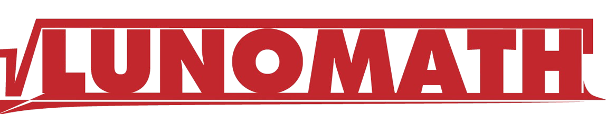

<div align="center">
  
</div>

# LunoMath

**LunoMath** is a simulation software for real-time [Mathematical model](https://en.wikipedia.org/wiki/Mathematical_model) planning and proofing.

> DISCLAIMER: Currently in development.

### Design and Philosophy
This project aims to run on embedded devices, specifically ARM9-based microprocessors. 
These devices are typically limited, often lacking useful features such as [Floating-Point Units](https://www.youtube.com/watch?v=ssDBqQ5f5_0), leading to slower and inefficient programmes.

However, it is possible to surpass these limitations by doing an "low-level hacking", paying attention to every single line of code and its performance.


Our goal is to provide a tool that can be used not only as a prototyping tool but also as an entire real-time framework for embedded projects.

---

## Building
### Requirements
This project uses the following tools:

- [Premake5](https://premake.github.io/) Building System.
- [Simple Directmedia Layer 2 (SDL2)](https://www.libsdl.org/) for the GUI client.
- [SDL2_ttf](https://www.libsdl.org/) for text rendering.
- [Dear ImGUI](https://github.com/ocornut/imgui/) for UI/UX stuff.

### Steps to Compile:
```sh
# On Windows (Visual C++):
$ ./build_win.bat

# For GCC:
$ premake5 gmake
$ make
```
License
-------
Copyright 2025, Lunoversis Robotics ( Joao H. Jari )

Permission is hereby granted, free of charge, to any person obtaining a copy of this software and associated documentation files (the "Software"), to deal in the Software without restriction, including without limitation the rights to use, copy, modify, merge, publish, distribute, sublicense, and/or sell copies of the Software, and to permit persons to whom the Software is furnished to do so, subject to the following conditions:

The above copyright notice and this permission notice shall be included in all copies or substantial portions of the Software.

THE SOFTWARE IS PROVIDED "AS IS", WITHOUT WARRANTY OF ANY KIND, EXPRESS OR IMPLIED, INCLUDING BUT NOT LIMITED TO THE WARRANTIES OF MERCHANTABILITY, FITNESS FOR A PARTICULAR PURPOSE AND NONINFRINGEMENT. IN NO EVENT SHALL THE AUTHORS OR COPYRIGHT HOLDERS BE LIABLE FOR ANY CLAIM, DAMAGES OR OTHER LIABILITY, WHETHER IN AN ACTION OF CONTRACT, TORT OR OTHERWISE, ARISING FROM, OUT OF OR IN CONNECTION WITH THE SOFTWARE OR THE USE OR OTHER DEALINGS IN THE SOFTWARE.